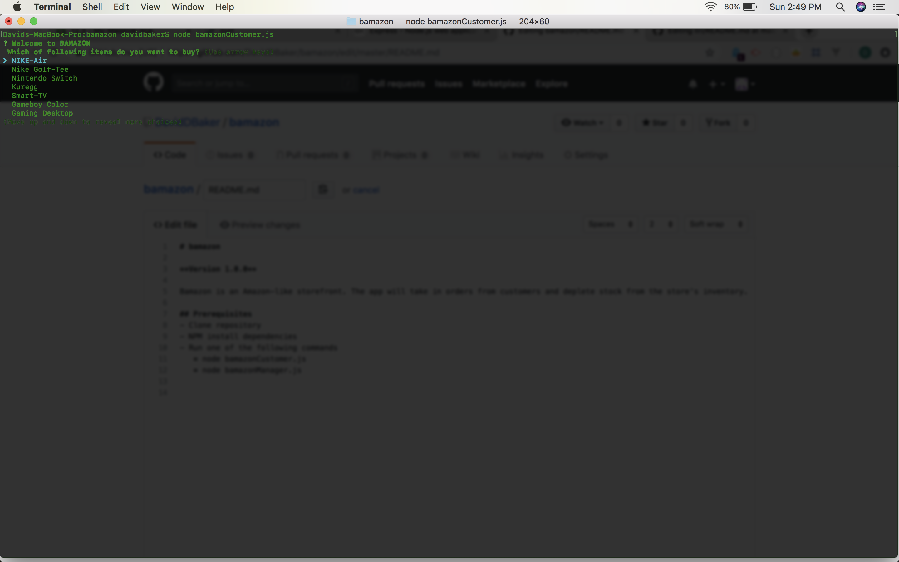
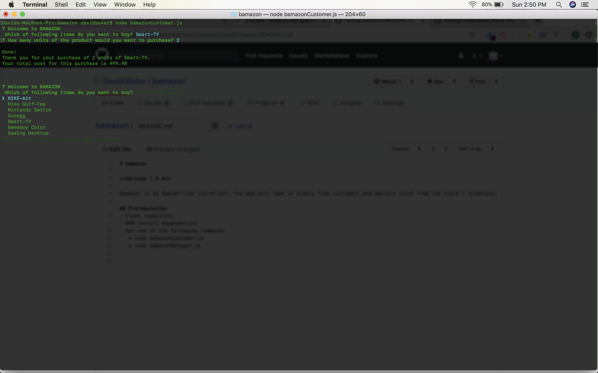
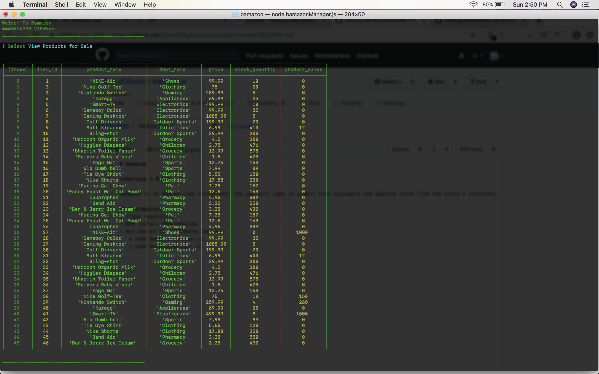
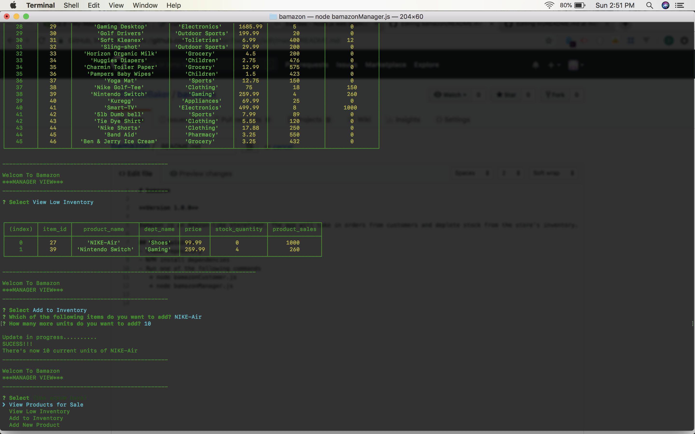

# bamazon

**Version 1.0.0**

Bamazon is an Amazon-like storefront. The app will take in orders from customers and deplete stock from the store's inventory.

## Prerequisites
- Clone repository
- NPM install dependencies
- Run one of the following commands
   * node bamazonCustomer.js
   * node bamazonManager.js
   
   ## Screenshots

